# HIMALIST-0610 Docs

**Main file of HimaList anime recomendations**

Contain all configuration file, and asset system design structures.
- This project covers all stages of software development — from design, database design, to project management.

---

Wireframe

**Preview Wireframe:**

<table align="center">
  <tr>
    <td align="center">
      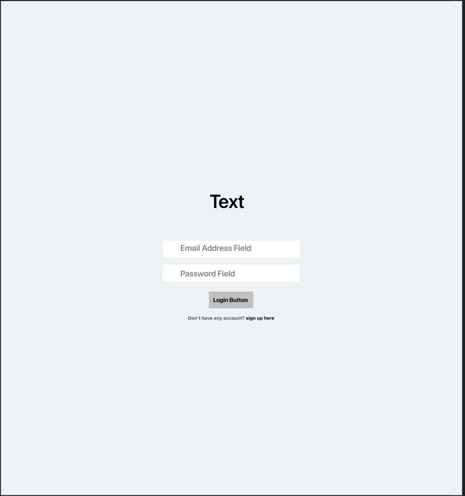 
      <b>Image 1:</b> Wireframe Login
    </td>
    <td align="center">
      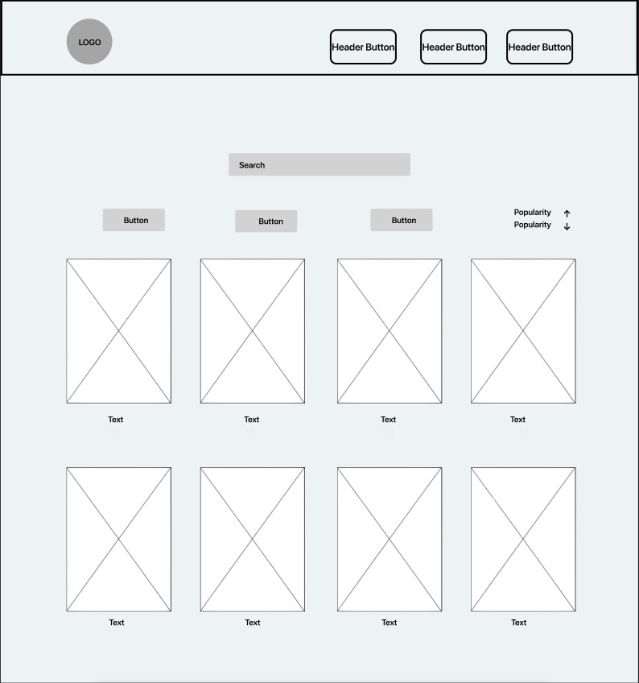 
      <b>Imager 2:</b> Wireframe Gallery
    </td>
  </tr>
</table>

---

Data Flow Diagram (DFD)

**Image DFD:**

<table align="center" width="100%">
  <tr>
    <td align="center" width="50%">
      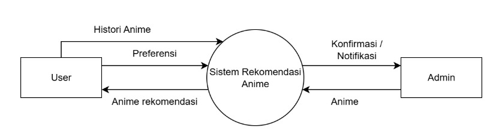
       <b>Image 1:</b> DFD Level 0
    </td>
    <td align="center" width="50%">
      
       <b>Image 2:</b> DFD Level 1
    </td>
  </tr>
  <tr>
    <td align="center" width="50%">
      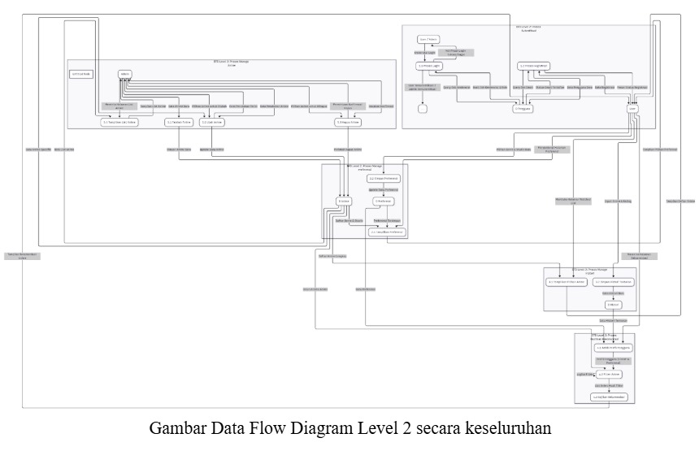
       <b>Image 3:</b> DFD Level 2
    </td>
    <td align="center" width="50%">
      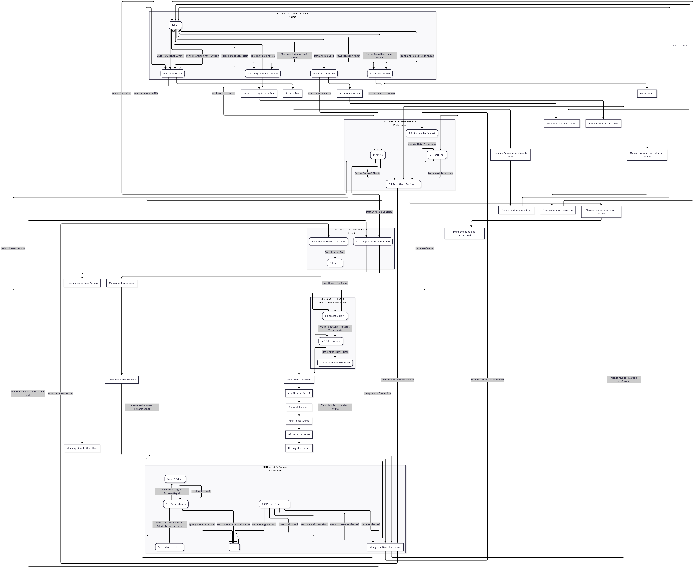
       <b>Image 4:</b> DFD Level 3
    </td>
  </tr>
</table>

---

Entity Relationship Diagram (ERD)

**Desain ERD:**

  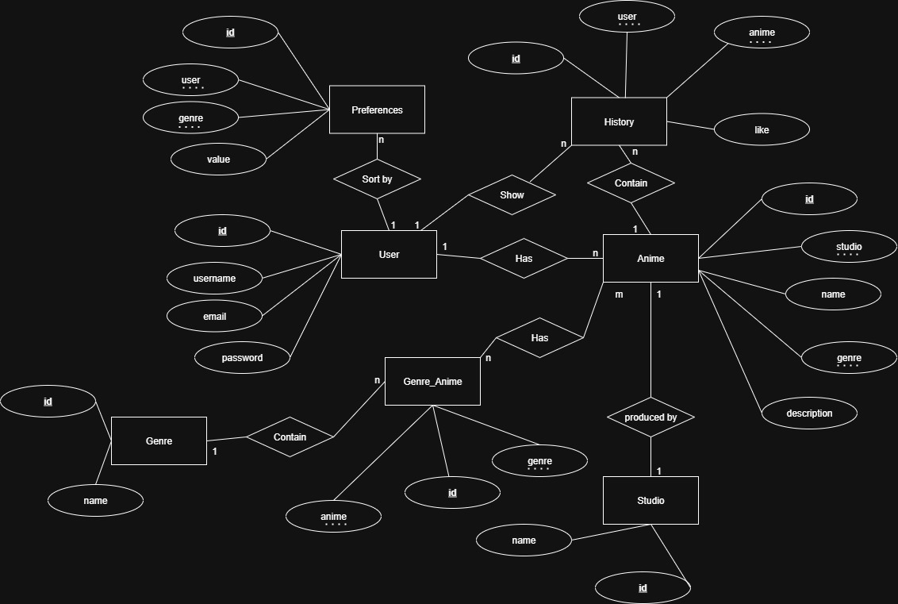

---

Normalisasi (NF)

**Tabel Normalisasi:**
<table align="center" width="100%">
  <tr>
    <td align="center" width="50%">
      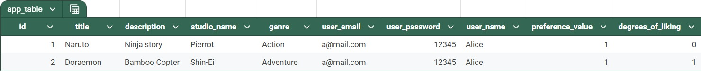
       <b>Image 1:</b> NF Level 1
    </td>
    <td align="center" width="50%">
      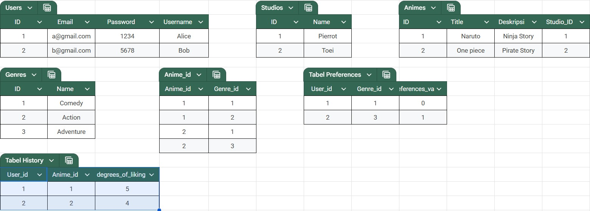
       <b>Image 2:</b> NF Level 2
    </td>
  </tr>
  <tr>
    <td align="center" colspan="2">
      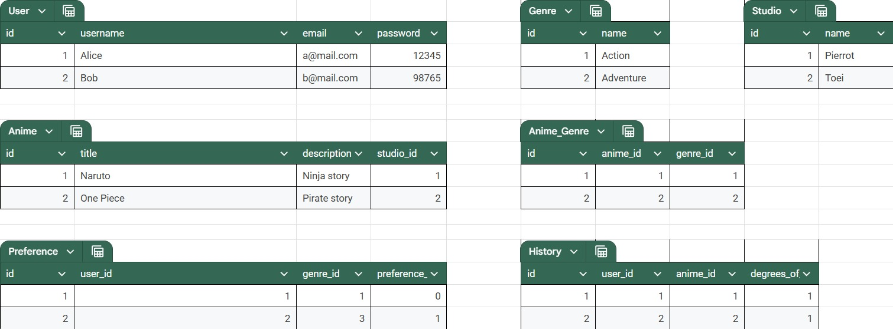
       <b>Image 3:</b> NF Level 3
    </td>
  </tr>
</table>

---

Class Diagram

**Class Diagram Design:**

  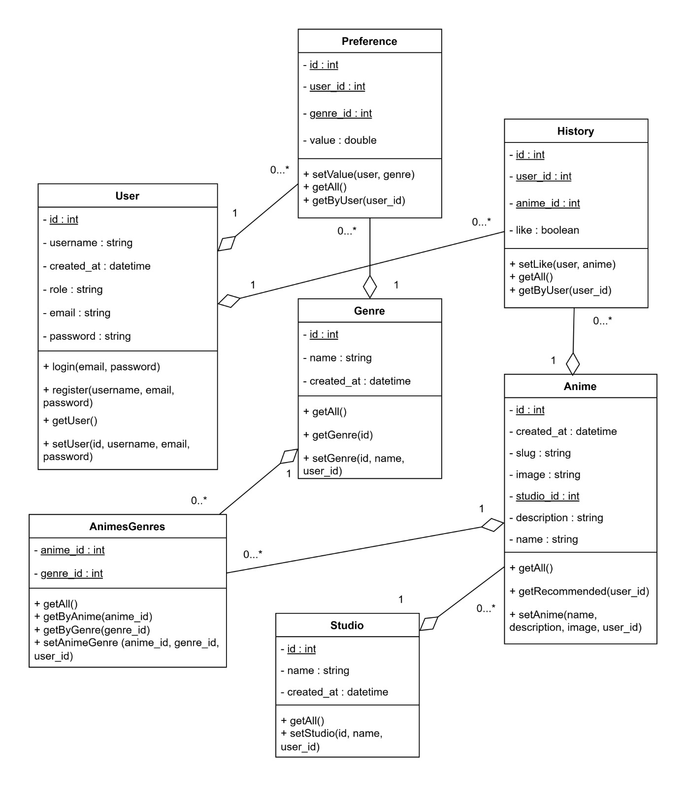

---

Activity Diagram

**Activity Diagram Design:**
<table align="center">
  <tr>
    <td align="center">
       
      <b>Image 1:</b> AD Register
    </td>
    <td align="center">
      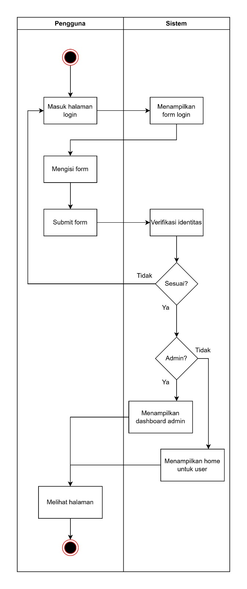 
      <b>Imager 2:</b> AD Login
    </td>
  </tr>
</table>

---

Use Case Diagram

**Use Case Diagram Design:**
<table align="center">
  <tr>
    <td align="center">
      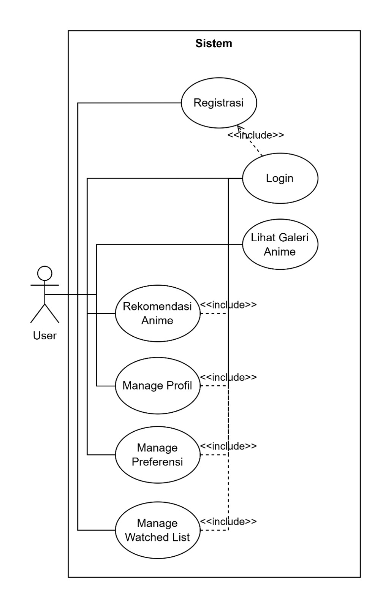 
      <b>Image 1:</b> UC User
    </td>
    <td align="center">
      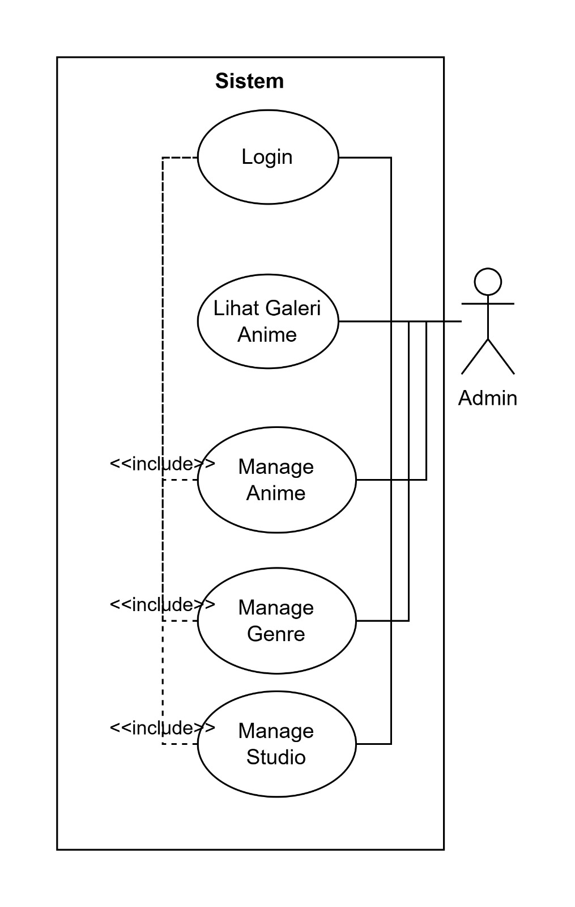 
      <b>Imager 2:</b> UC Admin
    </td>
  </tr>
</table>

---

Sequence Diagram

**Sequence Diagram Design:**
<table align="center">
  <tr>
    <td align="center">
       
      <b>Image 1:</b> SD Register
    </td>
    <td align="center">
      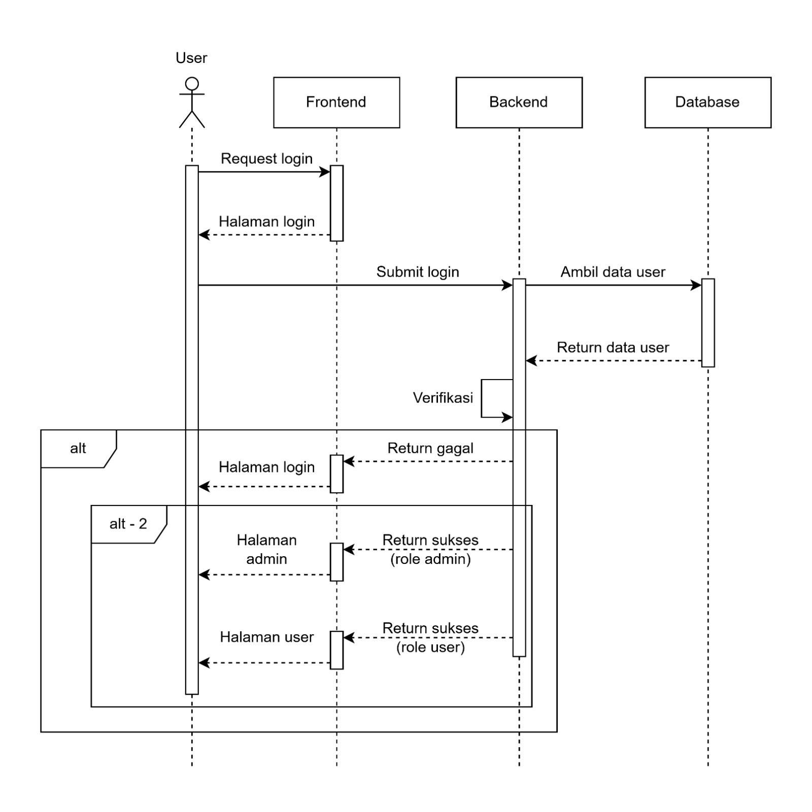 
      <b>Imager 2:</b> SD Login
    </td>
  </tr>
</table>

---

Links

- **Figma:**  [Figma Design Board](https://www.figma.com/design/UQrC08gozWaeG7Dwr6Ha7I/Untitled?node-id=0-1&t=I0XLnOMnqJYZ1xcq-1)

- **Trello:**  [Trello Project Board](https://trello.com/invite/b/68d0acb724dd28b75ff5bd2e/ATTI5f76dc0c9e0611fb75d2db4f198b5350C273EC25/himalist-progress-status)

- **GitHub:**   [GitHub Repository](https://github.com/lauraneval/HIMALIST-0610.git)

---
